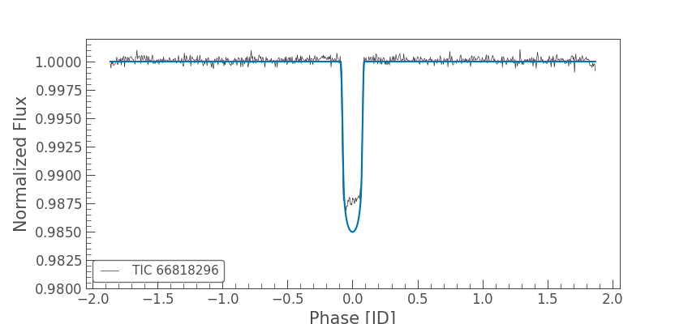
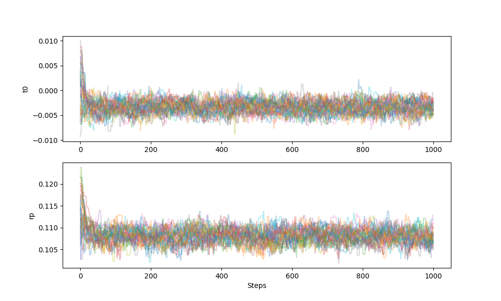
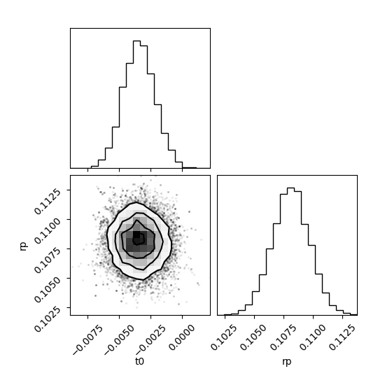

# WASP-17b Transit Detection and Radius Measurement using TESS Photometry

## What is this project?

I built a pipeline for transits of exoplanets and used it to measure the radius of WASP-17b. This planet was chosen for this project due to its large size and ease of transit detection. Published measurements from Anderson et al. (2010) were used to validate the results. I used three TESS sectors (12, 38, and 91) with 120-second cadence.

## Physics

### What is a transit? 

When a planet passes in front of its star, it blocks a portion of the star's light. From Earth, we see the star getting dim for few hours and then brighten again. This dip in brightness is a **transit**. By measuring how deep this dip is, we can calculate the planets radius relative to its star. The formula for the same is:

```
Transit Depth = (Rp / Rs)²
```

where `rp` is the planet's radius and and `rs` is the star's radius.

## Methods

### 1. Data Acquisition

I used `lighkurve` python package to search and download TESS observations for WASP-17b (TIC 66818296). TESS observes in sectors of 27 days. I downloaded three sector data at a 2-minute cadence, which means it measures the brightness every 2-minutes. This multisector data was cleaned using the techniques given below and stitched together for final result.

### 2. Outlier Removal and Flattening

Raw TESS light curves contains slow brightness variations caused by star itself like stellar rotation, star spots and instrumental drift. These trends need to be removed before we can measure the transit accurately. This process is called flattening.

This is done by **Savitzky-Golay filter**, which requires a parameter `window_length` i.e, the number of points the filter uses at once. This parameter should be less than orbital period and more than transit duration. If window length is more than orbital, period it sees more than one dips at once and tries to pull down the base line of the data making the dip shallower. If window lenth is less than transit duration, it tries to fit the transit dip into the data therefore removing the dip.

For WASP-17b(period = 3.735 days, cadence = 2 min), we took one third of the period as window length which is about 901 cadences(~30 hours), which lies between the orbital period and transit duration.

Outlier removal was applied before flattening with a 7-sigma clip to remove cosmic rays and single-point anomalies.

### 3. Phase Folding

WASP-17b transits every 3.735 days. Instead of analysing each transit we fold all the transits on top of each other which stacks the signal and averages out the noise, hence giving us a cleaner transit shape.

To fold correctly, we need two things:
- The **Orbital Period**
- The **Epoch Time**(the exact time of one known transit — this sets where phase zero is)

We used the published ephemeris from Anderson et al. 2010 instead of estimating these from the data using BLS (Box Least Squares). BLS gives only a rough estimate, and folding with an imprecise period causes the transits to not stack perfectly resulting in shallower transit.

The published epoch is given in BJD (Barycentric Julian Date), but TESS uses a shifted time system called BTJD (Barycentric TESS Julian Date):
 
```
BTJD = BJD − 2457000.0
 
T0 (BJD)  = 2454592.80118
T0 (BTJD) = 2454592.80118 − 2457000.0 = −2407.19882
```

### 4. Binning

The folded light curve still has many data points per phase bin due to multiple stacked transits. We binned the data to reduce the number of points while preserving the transit shape. We used a bin size of 0.005 days (~7 minutes). This was chosen because:
 
- WASP-17b's ingress and egress each last about 25 minutes.
- A 7-minute bin gives roughly 3–4 bins across each ingress/egress.
- This is fine enough to resolve the transit shape for batman to fit accurately.


### 5. Transit Model
 
We used the **batman** package (Kreidberg 2015) to generate synthetic transit light curves. batman takes a set of physical parameters and computes the expected flux at each time stamp based on the geometry of the planet crossing the stellar disk.
 
The parameters used are:
 
| Parameter | Description | Treatment |
|---|---|---|
| `t0` | Time of mid-transit | **Fitted** |
| `Rp/Rs` | Planet-to-star radius ratio | **Fitted** |
| `inc` | Orbital inclination | Fixed (published) |
| `a/Rs` | Scaled orbital distance | Fixed (published) |
| `period` | Orbital period | Fixed (published) |
| `ecc` | Eccentricity | Fixed at 0 |
| `w` | Argument of periastron | Fixed at 90° |
| `u1, u2` | Limb darkening coefficients | Fixed (literature) |

Limb darkening describes the fact that the edges of the star are dimmer than the center. We used a **quadratic limb darkening law** with coefficients `u1 = 0.29, u2 = 0.31` appropriate for TESS's red bandpass.

### 6. MCMC Paramter Estimation

We used **MCMC (Markov Chain Monte Carlo)** with the `emcee` package to find the best-fit parameters and their uncertainties. The idea is simple, 32 walkers explore different combinations of t0, Rp/Rs. Each combination is scored by how well the batman model matches the data using a chi-squared metric. Walkers gradually cluster around the best-fitting region, and the full collection of their positions gives us both the parameter values and their error bars.

We used flat priors to keep walkers within physically reasonable bounds:
 
```
−2  < t0    < 2   days
 0 < Rp/Rs < 1
 ```
The sampler ran in two phases — 300 burn-in steps (discarded) to let walkers find the best region, followed by 1000 production steps used for the final results (32,000 total samples).

**Convergence was checked visually using two plots:**
 
- **Trace plot** — shows the position of all 32 walkers at every step for each parameter. If the walkers look like tangled horizontal lines settled around a stable value, the sampler has converged. Drifting or separating walkers would indicate a problem.
- **Corner plot** — shows the 1D posterior histogram of each parameter and the 2D correlations between every pair. The histograms should look like smooth bell curves.

## Results

| Parameter | This Work | Literature | Source |
|---|---|---|---|
| Rp/R★ | 0.108052 ± 0.001567 | 0.1288 ± 0.0016 | Anderson et al. (2010) |
| Period | 3.7354883 days | 3.7354417 days | Anderson et al. (2010) |


*Phase folded TESS lightcurve with batman transit model overlay*


*MCMC trace plot showing convergence of all 32 walkers*


*Corner plot showing posterior distributions of t0 and Rp/Rs*

CROWDSAP correction was applied to the raw rp (~0.103) inside the log probability function, the value used for correction was mean of all the three CROWDSAP values from different sectors.

The discrepancy arises because TESS observes in a redder bandpass. WASP-17b's atmosphere absorbs more light at shorter wavelengths, making the planet appear larger in optical measurements compared to TESS.

## Requirements
 
```
lightkurve
batman-package
emcee
corner
scipy
numpy
matplotlib
```
 
Install all dependencies with:
 
```bash
pip install lightkurve batman-package emcee corner scipy numpy matplotlib
```
 
---

## How to Run

Clone the repository, install dependencies, then open and run `transit_pipeline.ipynb` from top to bottom.

## References
 
- Anderson et al. (2010) — WASP-17b discovery paper, *ApJ*
- [lightkurve documentation](https://lightkurve.github.io/lightkurve/)
- Kreidberg (2015) — batman: BAsic Transit Model cAlculatioN in Python, *PASP*
- Foreman-Mackey et al. (2013) — emcee: The MCMC Hammer, *PASP*


